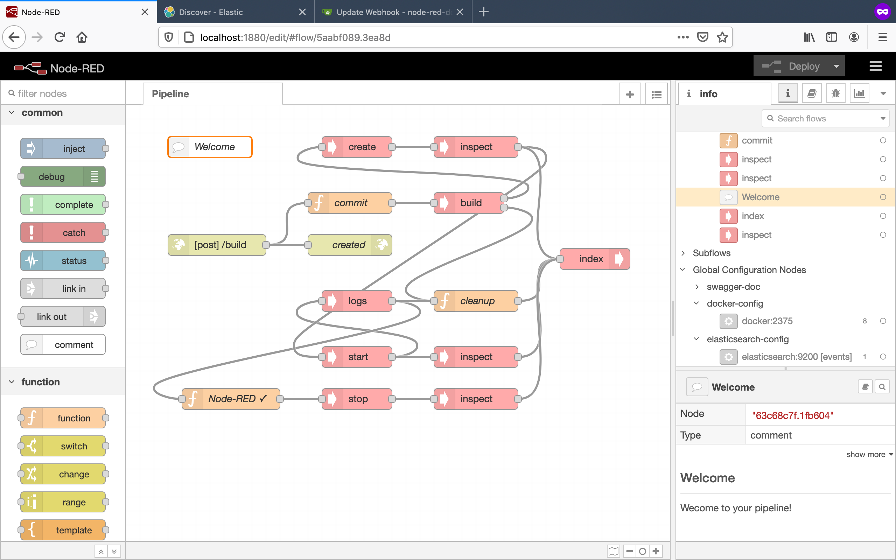

# node-red-docker

- Build images
- Create create, start, stop and inspect containers
- Read build and run logs

## Prerequisites

Gogs: `docker run --rm --name gogs -v $(pwd)/gogs:/data -p 3000:3000 gogs/gogs`
Docker on PORT 1234: `docker run --rm --name proxy -v /var/run/docker.sock:/var/run/docker.sock -p 1234:1234 dimdm/simple-docker-proxy`

## Use

`docker run --rm --name node-red-docker -v $(pwd):/data -p 1880:1880 dimdm/node-red-docker`

| Component     | URL |
| ------------- | --- |
| Editor        | http://localhost:1880/edit |
| API           | http://localhost:1880/http-api/swagger.json |
| Git           | http://localhost:3000/ |
| Webhook       | http://localhost:1880/build |
